## LovePetShopping

### 宠爱.U商城
旨在做一款宠物喂养呵护，宠物用品浏览购买等平台
其中有宠物首页商品按类型展示，自己的爱宠“衣食住行”，娱乐，健康等更简洁明了的展示，用户良好的交互体验，随时发现适合自己爱宠的物品。
其中分类板块可以更快更直观的发现好货。
爱宠联盟，购物车，个人等优化设计，平滑的平台为用户提供一个简洁比较完善的一个商城平台。
开源只为共同学习，请勿商用。
问题或者指正请EMAIL: maiduoduo0@163.com

#### 目前已完成的或者正在完成功能模块有：

   - 主页：
 
			-底部导航搭建  TabLayout + Fragment
			-首页、主粮、零食、医疗保健、玩具、外出、等Fragment界面的搭建  TabLayout + Fragment + ViewPager
			-多类型流畅列表展示  RecyclerView + BaseQuickAdapter + BaseViewHolder
			-列表数据的响应事件
			-级联界面
			-事件冲突处理
			-列表内导航页签的悬停设计与实现
			-等（详见图片）

   - 分类
   
			-分类、品牌两个板块。Tablayout+ViewPager+Fragment
			-类似京东商城的分类板块
			-搜索、左右导航列表  
			-分类：为您推荐、服饰、窝垫、主粮、零食、玩具、清洁等
			-品牌：各个商家品牌推荐引导
	

   - 联盟：
   
   
			-各种爱宠大V心得日记，互相交流养宠经验以及生活文章互动等板块
			-排行榜、体验师、体验报告
			-狗狗、猫猫的类型切换
			-列表内悬停导航
			等
			
			
   - 我的
    
			-登录/注册
			-导航列表，板块式引导入口
			-设置
			-Zxing优化库
	
   -动画效果
   
			-首页的切站点属性动画
			-我的签到动画

   -其他板块
   
			-切换常住地界面，切换地区
			-搜索详情界面
			-消息界面
			等

#### 后续要完成

		- 消息界面
		- 购物车板块
		- 消息推送
		- 商品详情
		- 等

#### 其中使用的三方开源框架（后期会细化整理所有项目使用到的开源框架）

		  -BaseQuickAdapter
		  -Glide
		  -Fresco
		  -Zxing
		  等
		  -感谢开源，感谢项目中的开源方
		  

#### 环境
		
		-AndroidStudio3.2
		
			-Android Studio 3.2
			Build #AI-181.5540.7.32.5014246, built on September 18, 2018
			JRE: 1.8.0_152-release-1136-b06 amd64
			JVM: OpenJDK 64-Bit Server VM by JetBrains s.r.o
			Windows 10 10.0
			
		-SVN
		
		_gradle构建：gradle-4.6-all.zip
		
  
#### 声明

		-此项目只作为平时开发练习及构思项目，请勿做其他任何商用，
		
		-项目部分数据来源于 **E宠商城**
		
		-如果项目中引入框架或者数据上有侵范行为，请联系我删除。Email:maiduoduo0@163.com

		-感谢开源及开发性环境，才能使技术越走越远，内容越来越丰富，越来越规范。

### 宠爱商城LOGO 

	
	 
   #### 个人设计，请勿他用
   

### 宠爱商城运行效果展示

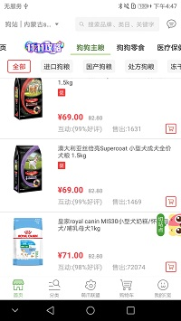
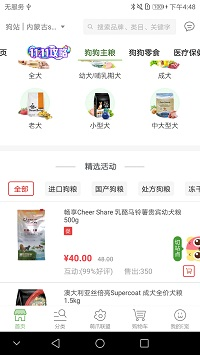
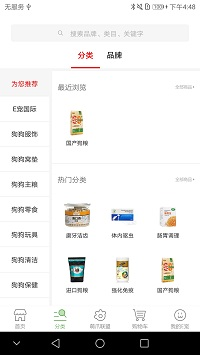
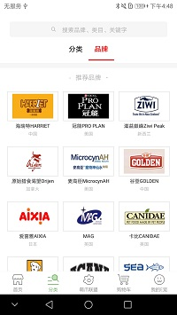
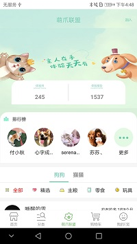
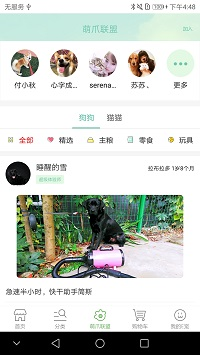
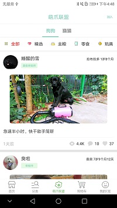
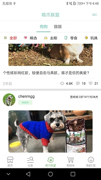
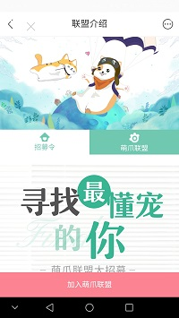
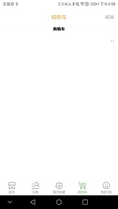
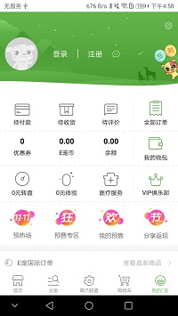
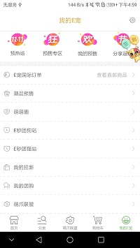

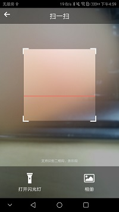
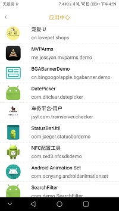
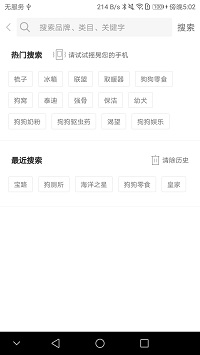

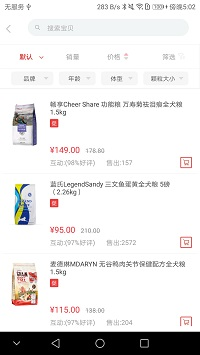
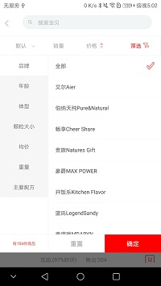
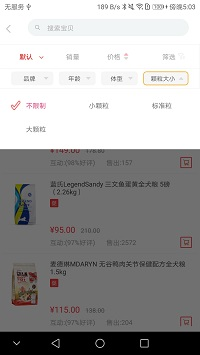
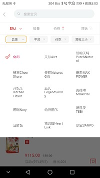

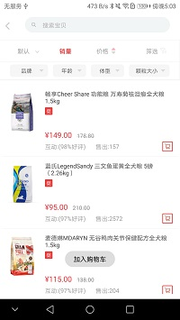
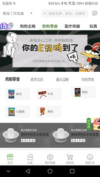
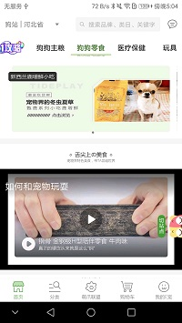

## 关于LICENSE

	- 爱宠商城项目只作为平时开发练习及构思交流项目，请勿做其他任何商用。
	- 归属解释权于dingcl,联系邮箱：maiduoduo0@163.com
	

Copyright (C) dingcl, nanjCodeTeam. Open source codes for study only.
Do not use for commercial purpose.

Licensed under the Apache License, Version 2.0 (the "License");
you may not use this file except in compliance with the License.
You may obtain a copy of the License at

   http://www.apache.org/licenses/LICENSE-2.0

Unless required by applicable law or agreed to in writing, software
distributed under the License is distributed on an "AS IS" BASIS,
WITHOUT WARRANTIES OR CONDITIONS OF ANY KIND, either express or implied.
See the License for the specific language governing permissions and
limitations under the License.
